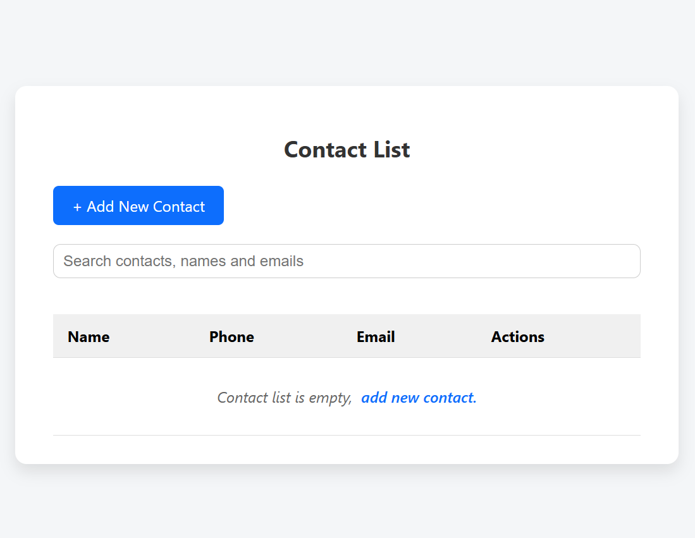
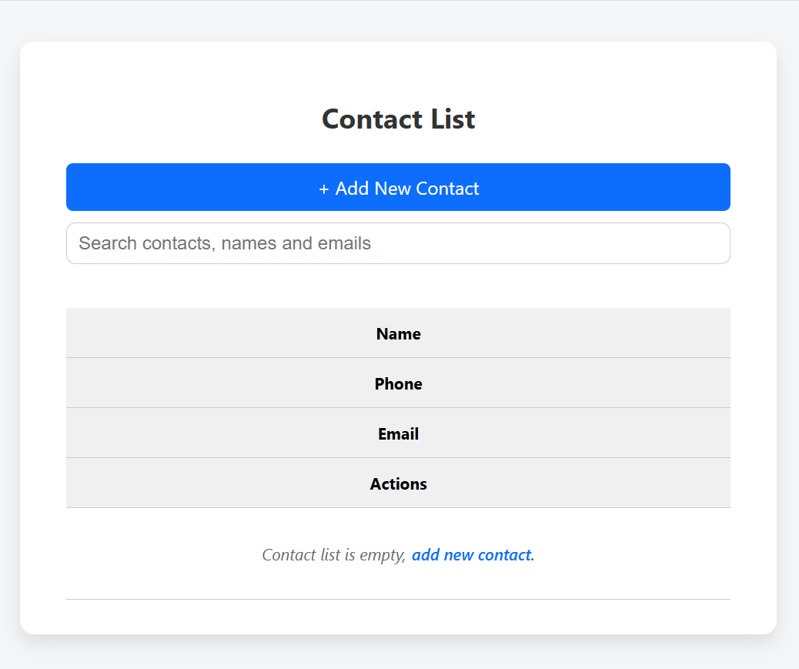
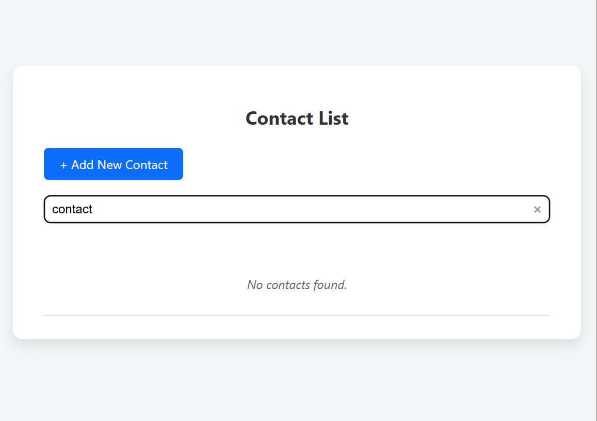
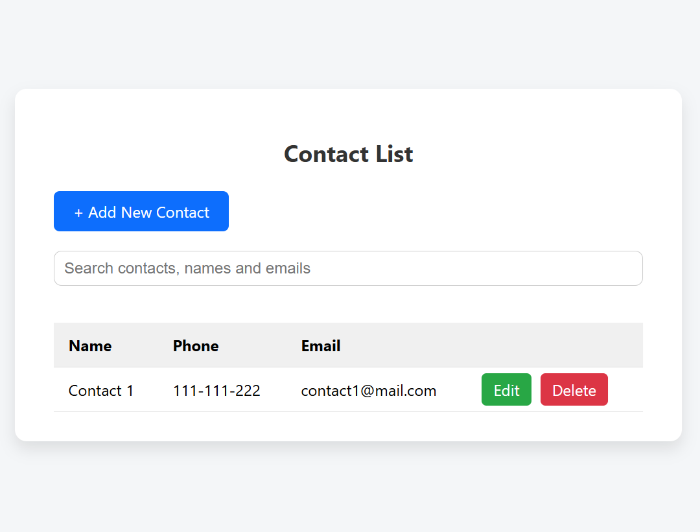
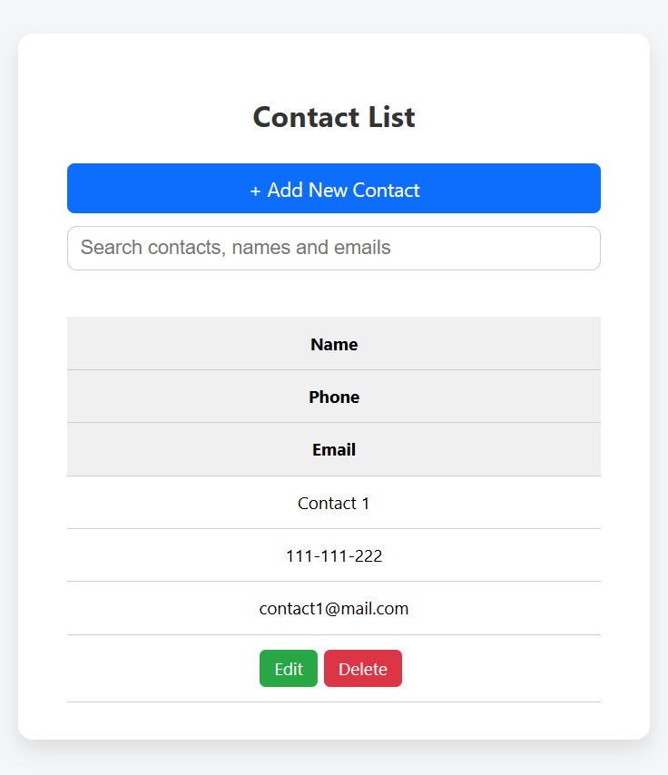
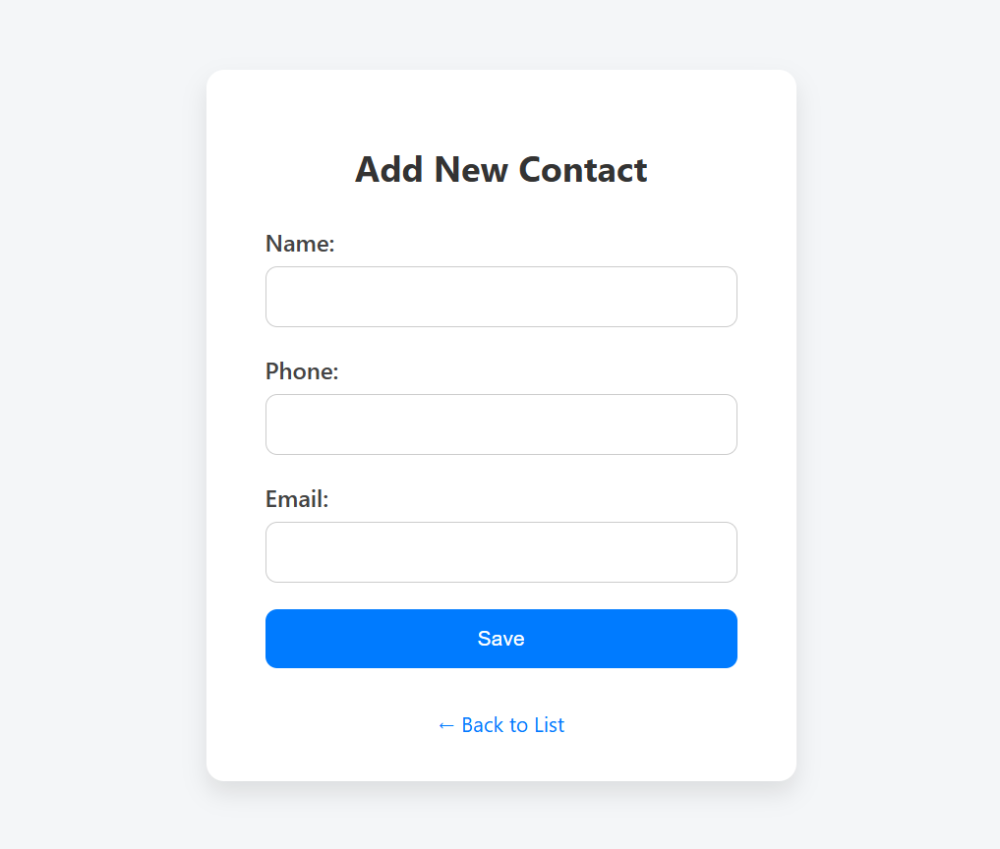
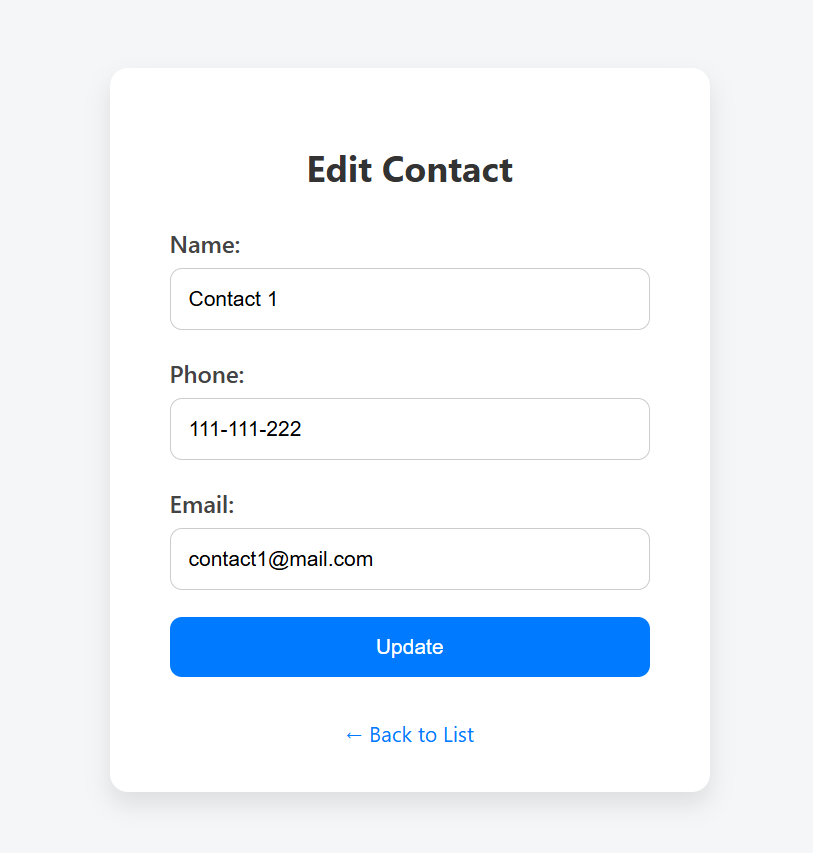

# 📇 PHP Contact Manager
A lightweight **PHP**-based contact manager for storing and managing **📧 emails** and **📱 phone numbers**.  
Perfect for small projects, personal contact lists, or learning basic **CRUD** operations in PHP.


## ✨ Features
- ➕ **Add Contacts** – Save name, 📧 email, and 📱 phone number.
- 👀 **View Contacts** – Display all saved contacts in a neat table.
- ✏️ **Edit Contacts** – Update existing contact details.
- ❌ **Delete Contacts** – Remove unwanted entries.
- 🔍 **Search Contacts** – Find contacts by name, email, or phone number.
- 🎨 **Responsive styling** – Adjusts to different screen sizes.
- 🔒 **Secured** – Prepared statements are used to prevent SQL injection.
- 💾 **Persistent Storage** – Stores data in **MySQL** or local file.

## 🌐 Live Demo
You can visit directly from your browser:
[Try Demo](https://mycontactapp.page.gd/)

## 📂 Folder Structure
```text
contact-manager/
│
├── index.php       # Main dashboard for viewing contacts
├── add.php         # PHP script to add new contact
├── edit.php        # PHP script to edit an existing contact
├── delete.php      # PHP script to delete a contact
├── export.php      # PHP script to export contacts
├── import.php      # PHP script to import contacts
├── search.php      # PHP script to search contacts
├── db.php          # Database connection file
├── db.sql          # Database and table SQL file
├── css/
│  └── style.css    # Styling
├── js/
│  └── modals.js    # Modal script
│  └── search.js    # Search script
├── composer.json   # PHP project dependencies manager
└── README.md       # Documentation
```

## 🚀 Getting Started
### 1️⃣ Requirements
- 🐘 PHP 7.4+  
- 🗄️ MySQL / MariaDB  
- 🌐 Web server (Apache/Nginx or PHP built-in server)

### 2️⃣ Installation
1. **Clone the repository using Git**
   ```
   git clone https://github.com/rytvee/contact-manager.git
   cd contact-manager
   ```
2. **Configure the database**
- Install db.sql
- Edit `db.php`:
```
$host = "localhost";
$username = "root";
$password = "";
$dbname = "contact_manager";
```
3. **Install PHP dependencies using Composer**
```
composer install
```
4. **Run the project**
- If using PHP’s built-in server:
```
php -S localhost:8000
```
Then visit http://localhost:8000 🌍


## 📷 Screenshots
**Contact list empty**





**Contact empty search**



**Contact list**





**Add contact**



**Edit contact**




## 📜 License
This project is free to use and modify.
